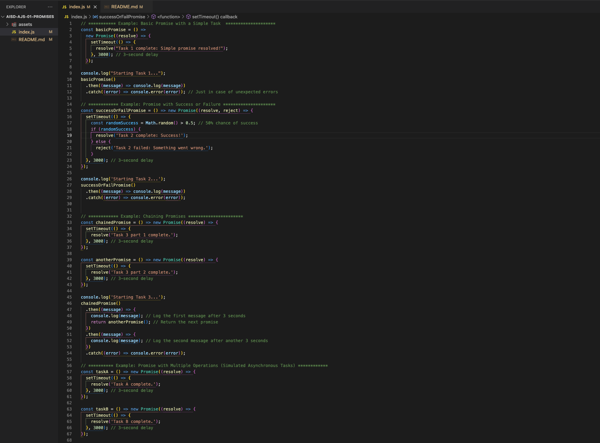

# `Promises with setTimeout()`: Managing Asynchronous Tasks in JavaScript



---

## Description 📄

In JavaScript, **promises** are an essential tool for handling **asynchronous operations**, allowing developers to write **non-blocking code**. This means that while one task is delayed, JavaScript can continue executing other tasks, making the application more efficient and responsive. A promise is essentially an object representing the eventual completion (or failure) of an asynchronous operation.

In this lab, you'll learn how to combine **promises** with `setTimeout()` to simulate **real-world scenarios** like:
- **Delaying tasks** and resolving promises after a set amount of time.
- **Simulating random successes and failures** with promises.
- **Chaining promises** to handle sequential tasks.
- Using **Promise.all()** to run multiple asynchronous tasks in parallel and handle their results collectively.

This lab focuses on using `setTimeout()` with promises to practice handling **delays**, **success/failure scenarios**, and **promise chaining**. Understanding promises is crucial for working with asynchronous code, including **fetching data from APIs**, handling **delayed operations**, or processing **multiple tasks simultaneously**.

## Expected Project Structure 🏗️
Your project should be structured as follows:

```plaintext
promises-settimeout-lab/
├── script.js
└── README.md
```

##

## Instructions ✅

### 1. **Create the Project Folder and Files**
   - [ ] Create a project folder named `promises-settimeout-lab` to store your project files.

   - [ ] Inside the `promises-settimeout-lab` folder, create a file named `script.js`. This will be your main JavaScript file where all your code will be written.

##

#### 2. **Basic Promise with `setTimeout()`**

In this step, you will create a basic example using **promises** combined with `setTimeout()` to understand how JavaScript handles **asynchronous code**. This approach allows tasks to be delayed while the rest of the program continues executing, ensuring **non-blocking** behavior and smooth user experiences.

- [ ] Add the following code to your `script.js` file:

```javascript
// Example: Basic Promise with a Simple Task
const basicPromise = () =>
  new Promise((resolve) => {
    setTimeout(() => {
      resolve("Task 1 complete: Simple promise resolved!");
    }, 3000); // 3-second delay
  });

console.log("Starting Task 1...");
basicPromise()
  .then((message) => console.log(message)) // expected: Task 1 complete: Simple promise resolved!
  .catch((error) => console.error(error)); // Catches any unexpected errors
```

 [ ] Run your code using Node.js in the terminal:

```bash
node index.js
```

### Expected Output:

```bash
Starting Task 1...
Task 1 complete: Simple promise resolved!
```

### Explanation:

- **Creating the Promise:** The `basicPromise` function returns a new `Promise` that resolves after a 3-second delay. This simulates an asynchronous task where the promise resolves with the message `"Task 1 complete: Simple promise resolved!"`.

- **Asynchronous Execution:** The message `"Starting Task 1..."` is logged to the console immediately when the code begins, showing that JavaScript doesn’t wait for the `setTimeout()` to finish.

- **Promise Resolution:** After 3 seconds, the promise is resolved, and the message `"Task 1 complete: Simple promise resolved!"` is logged.

- **Error Handling:** The `.catch()` block is included to handle any potential errors. While this example doesn’t generate errors, it’s best practice to add this to catch and log any unexpected issues during execution.

This example demonstrates how **asynchronous programming** in JavaScript allows code to run without waiting for delayed operations to complete, improving the overall responsiveness of applications.

##

### 3. **Promise with Success or Failure**

In this step, you will create a promise that randomly either **resolves** or **rejects** after a 3-second delay. This will help you understand how JavaScript handles both success and failure cases in asynchronous code.

- [ ] **Comment out all the code** from the previous example in your index.js file to avoid conflicts.

- [ ] Add the following code to your `script.js` file:

```javascript
// Example: Promise with Success or Failure
const successOrFailPromise = () => new Promise((resolve, reject) => {
  setTimeout(() => {
    const randomSuccess = Math.random() > 0.5; // 50% chance of success
    if (randomSuccess) {
      resolve('Task 2 complete: Success!');
    } else {
      reject('Task 2 failed: Something went wrong.');
    }
  }, 3000); // 3-second delay
});

console.log('Starting Task 2...');
successOrFailPromise()
  .then((message) => console.log(message)) // Logs success message if resolved.
  .catch((error) => console.error(error)); // Logs error if rejected.
```

- [ ] Run your code using Node.js in the terminal:

```bash
node script.js
```

### Expected Output:

```bash
Starting Task 2...
Task 2 complete: Success!
```

or

```bash
Starting Task 2...
Task 2 failed: Something went wrong.
```

**Suggestion:**
Run your code multiple times to observe both the success and failure outcomes. Since the result is based on a random condition, running the code multiple times will help you understand how often the promise resolves successfully and how often it fails.

### Explanation:

- **Creating the Promise:** The `successOrFailPromise` function returns a new `Promise` that either **resolves** or **rejects** based on a random condition. There is a 50% chance for success or failure.

- **Asynchronous Execution:** The message `"Starting Task 2..."` is logged immediately when the code begins, before the promise has resolved or rejected.

- **Random Success or Failure:** After 3 seconds, the code checks if `Math.random()` returns a value greater than 0.5. If it does, the promise is **resolved** with the message `"Task 2 complete: Success!"`. If not, the promise is **rejected** with the message `"Task 2 failed: Something went wrong."`.

- **Error Handling:** The `.catch()` block is used to log the error when the promise is rejected, ensuring you are notified of failures.

- **Running Multiple Times:** Since the outcome is random, you should run the code multiple times to observe both the **success** and **failure** cases. Sometimes it will resolve, and other times it will reject, demonstrating the unpredictable nature of asynchronous tasks and the importance of handling both outcomes.

This example highlights the necessity of **error handling** in asynchronous JavaScript, ensuring your program can manage both successes and failures gracefully.

##

### 4. **Chaining Promises**

In this step, you will create a chain of promises where each task depends on the completion of the previous one. This approach is useful when you need to perform sequential asynchronous operations.

- [ ] **Comment out all the code** from the previous example in your index.js file again to avoid conflicts.

- [ ] Add the following code to your `script.js` file:

```javascript
// Example: Chaining Promises
const chainedPromise = () => new Promise((resolve) => {
  setTimeout(() => {
    resolve('Task 3 part 1 complete.');
  }, 3000); // 3-second delay
});

const anotherPromise = () => new Promise((resolve) => {
  setTimeout(() => {
    resolve('Task 3 part 2 complete.');
  }, 3000); // 3-second delay
});

console.log('Starting Task 3...');
chainedPromise()
  .then((message) => {
    console.log(message); // Log the first message after 3 seconds
    return anotherPromise(); // Return the next promise
  })
  .then((message) => {
    console.log(message); // Log the second message after another 3 seconds
  })
  .catch((error) => console.error(error)); // Handle any errors
```

- [ ] Run your code using Node.js in the terminal:

```bash
node script.js
```

### Expected Output:

```bash
Starting Task 3...
Task 3 part 1 complete.
Task 3 part 2 complete.
```

### Explanation:

- **Creating Chained Promises:** The `chainedPromise` function simulates an asynchronous task that takes 3 seconds to complete. Similarly, the `anotherPromise` function simulates a second task with a 3-second delay. Both functions return promises that will resolve after their respective delays, allowing you to handle these tasks asynchronously but in a predictable sequence.

- **Sequential Execution:** The first `.then()` block logs `"Task 3 part 1 complete."` to the console after the `chainedPromise` resolves (3 seconds). Importantly, this `.then()` returns the next promise, which is the result of calling `anotherPromise`. This return ensures that the second promise starts only after the first one has completed. The second `.then()` block logs `"Task 3 part 2 complete."` after an additional 3 seconds, once the second promise resolves. 

- **Chaining Promises:** Chaining allows asynchronous tasks to occur **sequentially**. The promise chain ensures that the second task (`anotherPromise`) does not start until the first task (`chainedPromise`) is complete. This method is particularly useful when one asynchronous operation depends on the outcome of a previous operation. For example, you might use chained promises when fetching data in stages, where one API request depends on the successful return of another.

- **Error Handling:** Although this example doesn’t expect any errors, the `.catch()` block is crucial for dealing with potential failures in the promise chain. If either promise (`chainedPromise` or `anotherPromise`) were to reject due to an error (such as a network failure in real-world scenarios), the `.catch()` block would catch the error and prevent the program from crashing unexpectedly. Instead, it would log the error for you to debug.

- **Why Chaining Matters:** By chaining promises, you ensure that multiple asynchronous tasks are executed in the correct order. This is essential in scenarios where tasks are dependent on each other. For instance, you might want to wait for data to load before performing an action or ensure that animations play in a specific sequence. Without chaining, these tasks could run in parallel and finish at unpredictable times, leading to unexpected results or failures.

This example demonstrates how to manage multiple **asynchronous operations** using **promise chaining**, ensuring that each task completes before the next one begins.

##

### 5. **Promise with Multiple Operations (Simulated Asynchronous Tasks)**

In this step, you will simulate multiple asynchronous tasks running in parallel and handling their results collectively. Using `Promise.all()`, you can ensure that all the promises resolve before proceeding or handle an error if any of them fail.

- [ ] **Comment out all the code** from the previous example in your index.js file again to avoid conflicts.

- [ ] Add the following code to your `script.js` file:

```javascript
// Example: Promise with Multiple Operations
const taskA = () => new Promise((resolve) => {
  setTimeout(() => {
    resolve('Task A complete.');
  }, 3000); // 3-second delay
});

const taskB = () => new Promise((resolve) => {
  setTimeout(() => {
    resolve('Task B complete.');
  }, 3000); // 3-second delay
});

const taskC = () => new Promise((resolve, reject) => {
  setTimeout(() => {
    const randomSuccess = Math.random() > 0.3; // 70% chance of success
    if (randomSuccess) {
      resolve('Task C complete.');
    } else {
      reject('Task C failed.');
    }
  }, 3000); // 3-second delay
});

console.log('Starting Task 4...');
Promise.all([taskA(), taskB(), taskC()])
  .then((messages) => {
    messages.forEach((message) => console.log(message)); // Log all success messages
  })
  .catch((error) => console.error(error)); // Log any error if one of the tasks fails
```

- [ ] Run your code using Node.js in the terminal:

```bash
node script.js
```

### Expected Output:

```bash
Starting Task 4...
Task A complete.
Task B complete.
Task C complete.
```

If taskC fails, you will see:

```bash
Starting Task 4...
Task C failed.
```

**Suggestion:**
Run your code several times to observe both the success and failure outcomes. Since `taskC` has a 30% chance of failure, running the code multiple times will allow you to see how `Promise.all()` handles both successful operations and cases where one promise rejects.

### Explanation:

- **Creating Multiple Promises:** 
  - `taskA` and `taskB` simulate asynchronous tasks that each take 3 seconds to complete. Both of these promises resolve successfully after their respective delays, simulating tasks that finish without issues.
  - `taskC`, on the other hand, simulates a task with an element of uncertainty. Like the other tasks, it has a 3-second delay, but it includes a random condition that determines whether it resolves or rejects. There’s a 70% chance that `taskC` will resolve successfully and a 30% chance that it will fail. This randomness mirrors real-world scenarios where some operations (like network requests) might fail unpredictably.

- **Running Tasks in Parallel:** 
  - The `Promise.all()` method is used to run `taskA`, `taskB`, and `taskC` **in parallel**. This means that all three promises are started at the same time, and the code doesn't wait for one to complete before starting the others. 
  - The code will then wait until **all** the promises are either resolved or one of them is rejected. If all the promises resolve successfully, the `.then()` block is executed, and all the success messages for the tasks are logged. However, if any of the promises reject (as could happen with `taskC`), the `.catch()` block is triggered, and the error message is logged. This demonstrates how `Promise.all()` handles both success and failure outcomes together.

- **Handling Success and Failure Together:** 
  - `Promise.all()` is a powerful tool because it allows you to run multiple asynchronous operations in parallel while ensuring that you only proceed once all the tasks are complete. However, if any single promise in the group fails, the entire operation is considered a failure.
  - In this example, if `taskC` fails due to the random 30% chance of failure, the `.catch()` block will be triggered, logging an error message and preventing further success handling. This reflects real-world cases where even if most tasks succeed, a single failure can affect the overall operation, such as in batch processing or API requests.

- **Why This Is Useful:** 
  - Running tasks in parallel is essential when dealing with **multiple independent asynchronous operations**. For example, you may need to fetch data from multiple APIs simultaneously or perform several computations in parallel to save time. Using `Promise.all()`, you can ensure that all tasks finish before moving on to the next step in your application logic, which is crucial when those results are interdependent.
  - Additionally, `Promise.all()` provides an efficient way to handle both success and failure cases collectively. This means that if one task fails, the overall process can be stopped and managed appropriately, ensuring that errors don’t go unnoticed.

This example shows how to manage multiple asynchronous tasks running in parallel using `Promise.all()`, ensuring that either all tasks complete successfully or an error is caught and handled if one task fails.

##

## Conclusion 📄

In this assignment, you gained hands-on experience working with **promises** and `setTimeout()` in JavaScript to manage **asynchronous operations**. By exploring how to handle tasks both sequentially and in parallel using `Promise.all()`, you developed a deeper understanding of **asynchronous programming** and how to manage both success and failure outcomes effectively.

### Key Takeaways:

- **Creating and Resolving Promises**: You learned how to build basic promises that resolve after a delay using `setTimeout()`, helping you grasp how promises provide a more structured way to manage asynchronous tasks.

- **Handling Success and Failure**: Through examples with random successes and failures, you practiced handling multiple outcomes using `.then()` and `.catch()`, which is essential for writing resilient and reliable code in real-world applications.

- **Chaining Promises for Sequential Tasks**: You explored how to chain promises to ensure tasks are performed **in sequence**. This technique is crucial when dealing with **dependent operations**, where one task must complete before the next begins.

- **Managing Multiple Tasks in Parallel**: By using `Promise.all()`, you learned how to run **multiple asynchronous tasks in parallel** and handle their results collectively. This technique is invaluable for scenarios where tasks are independent but need to complete before moving on to the next steps in your code.

- **Simulating Real-World Asynchronous Operations**: You experienced how JavaScript’s **non-blocking behavior** enables smooth and efficient performance by simulating multiple tasks, such as **network requests** or **parallel computations**, without halting the main execution thread.

By mastering these techniques, you are better equipped to build **dynamic, scalable JavaScript applications** that effectively handle **asynchronous operations**. This knowledge will help you create more responsive user experiences and manage complex workflows with ease, ensuring your code remains performant even when managing **time-sensitive tasks** or dealing with **multiple operations in parallel**.

##

### Solution codebase 👀
🛑 **Only use this as a reference** 🛑

💾 **Not something to copy and paste** 💾

**Note:**  This lab references a solution file located [here](https://github.com/HackerUSA-CE/aisd-ajs-01-promises/tree/solution) (link not shown).

---
© All rights reserved to ThriveDX